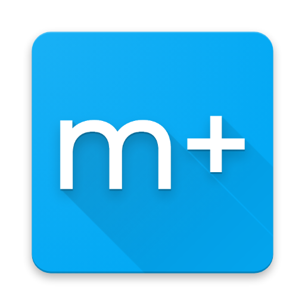

     
    
    

## ¿Qué es?
Esta aplicación es un sintonizador de canales de televisión por Internet (IPTV) **para abonados a Movistar+** compatible con dispositivos Android TV 5.0 o superior.

Es un sustituto básico del decodificador de Movistar que permite añadir los diales contratados a los del televisor como si fueran canales de TDT.

También es capaz de leer la **programación EPG** de estos canales y mostrarla en la guía TV del dispositivo.

## Preguntas frecuentes
- **¿Qué requisitos tiene?** 
  Android TV 5.0 o superior, que es una versión especial de Android para televisores. No confundir con Android boxes.
- **¿Es estable?** 
  No, es una versión en pruebas.
- **¿Hay que configurarlo?** 
  No, pero tienes que sintonizar la fuente de canales que crea después de instalar la app.
- **¿Puedo ver los canales sin tener Movistar+ contratado?** 
  No, con esta aplicación necesitas estar abonado a Movistar+ y solo puedes ver los canales que hayas contratado.
- **¿Tengo que hacer algún cambio en el router?** 
  No, si puedes ver la televisión en el decodificador de Movistar entonces debería funcionar.
- **¿Necesito conectar el televisor por cable?** 
  Aunque es recomendable utilizar Ethernet para evitar pérdidas en la señal, con WiFi en la banda de los 5 GHz funciona muy bien.

## Fallos conocidos
- La programación EPG a veces confunde los programas de dial o los omite por completo
- El desentrelazado de imagen todavía no funciona
- Esto es inestable de narices

## Aviso importante
Este software **SE PROPORCIONA "TAL CUAL", SIN GARANTÍA DE NINGÚN TIPO**, expresa o implícita, incluyendo (pero no limitándose a) las garantías de comerciabilidad, idoneidad para un propósito particular y no infracción.
En ningún caso, los autores o titulares del Copyright serán responsables de ninguna reclamación, daños o cualquier otra responsabilidad, ya sea en una acción de contrato, agravio o cualquier otro motivo, con o sin relación con el software o el uso u otros aspectos del software.
El presente software **NO ESTÁ SOPORTADO NI RESPALDADO** por Movistar ni por Telefónica.
Todas las marcas comerciales, marcas de servicio, nombres comerciales, nombres de productos y logotipos son propiedad de sus respectivos propietarios, incluyendo en algunos casos el Grupo Telefónica.
Su uso en el contexto de este software no constituye un respaldo ni apoyo por parte de sus respectivos propietarios.

## Agradecimientos
- [libVLC](https://wiki.videolan.org/LibVLC/)
- [XMLTV grabber](https://github.com/MovistarTV/tv_grab_es_movistartv)
- [Sample TV Channel App](https://github.com/googlesamples/androidtv-sample-inputs)
- [AlphaCentaury](https://github.com/AlphaCentaury/MovistarTV#informaci%C3%B3n-importante) (por el "aviso importante")
